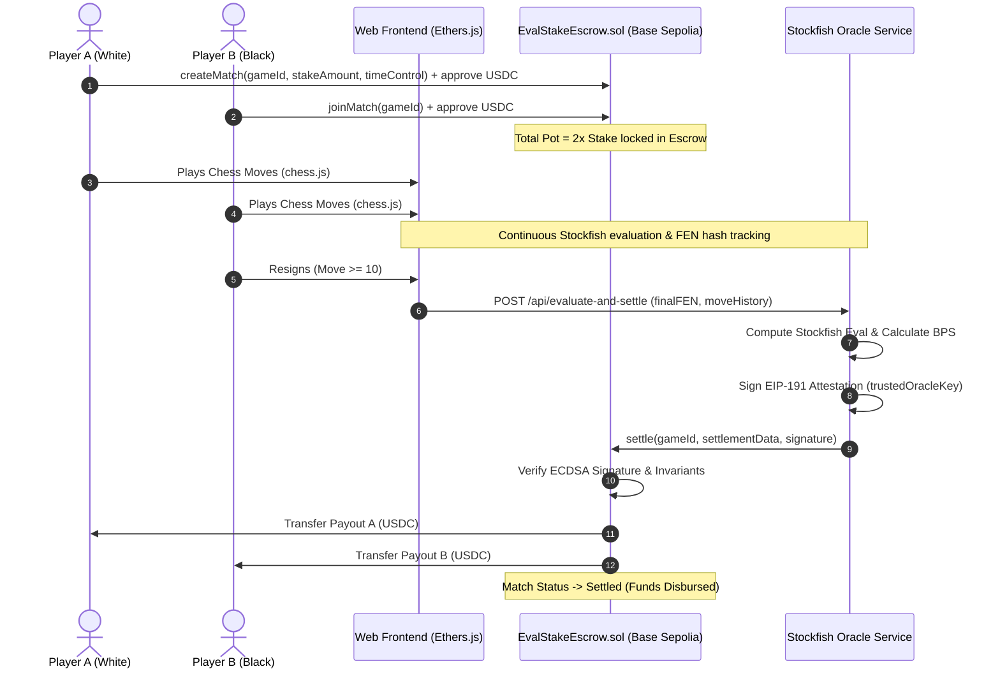

# ♟️ Centipawn — Evaluation-Based Proportional-Payout Chess Wagering

[](https://sepolia.basescan.org/address/0x0451c13fadBF8Fd8A6f1311d5d125778FC2ca5C0)
[](contracts/EvalStakeEscrow.sol)
[](LICENSE)
[](https://stockfishchess.org/)
[](https://vercel.com)

> **Continuous, Evaluation-Based Payouts on Base Sepolia.**  
> Transforming binary winner-take-all chess wagering into an evaluation-based staking market powered by Stockfish and on-chain smart contract escrows.

---

## 📖 Executive Summary

In traditional chess wagering platforms, games conclude in a binary winner-take-all outcome: a player who has outplayed their opponent across 40 moves but makes an inadvertent slip loses 100% of their stake. Conversely, losing players often drag lost games to the clock or rage-quit.

**Centipawn** solves this by introducing **Evaluation-Based Proportional Payouts**:
- Both players stake an equal amount of **ERC-20 USDC** into a verified Base Sepolia smart contract escrow.
- Standard FIDE chess rules apply throughout.
- **Checkmate & Timeout:** 100% of the pot goes to the victor.
- **Draw:** 50% / 50% split.
- **Resignation:** The pot is split proportionally according to the continuous **Stockfish evaluation** of the final board state, bounded by a logistic sigmoid win-probability curve.

---

## 🏛️ Verified Base Sepolia Deployments (Chain ID: `84532`)

All contracts and oracle keys are deployed and live on **Base Sepolia**:

| Component | Contract / Address | Explorer |
| :--- | :--- | :--- |
| **EvalStakeEscrow Contract** | `0x0451c13fadBF8Fd8A6f1311d5d125778FC2ca5C0` | [View on BaseScan](https://sepolia.basescan.org/address/0x0451c13fadBF8Fd8A6f1311d5d125778FC2ca5C0) |
| **Circle Testnet USDC** | `0x036CbD53842c5426634e7929541eC2318f3dCF7e` | [View on BaseScan](https://sepolia.basescan.org/address/0x036CbD53842c5426634e7929541eC2318f3dCF7e) |
| **Trusted Oracle Signer** | `0x410F8184bDdC5A98e7A45c2e695c6AF7D106A3a9` | [View on BaseScan](https://sepolia.basescan.org/address/0x410F8184bDdC5A98e7A45c2e695c6AF7D106A3a9) |

### 🔗 Live On-Chain Match Lifecycle Proof

The complete end-to-end match lifecycle has been verified on Base Sepolia:

1. **Escrow Contract Deployment**:  
   [`0x8bd6d6e1fa32f7e80b131fd79730980725fad09e98e0b5d60c6d9f715494b4cf`](https://sepolia.basescan.org/tx/0x8bd6d6e1fa32f7e80b131fd79730980725fad09e98e0b5d60c6d9f715494b4cf)
2. **Player A Match Creation & USDC Escrow Deposit (`createMatch`)**:  
   [`0xe739785725e8a87f06a5d839503d43ccd4c31f5654f576a2149091b8e1f598b8`](https://sepolia.basescan.org/tx/0xe739785725e8a87f06a5d839503d43ccd4c31f5654f576a2149091b8e1f598b8)
3. **Player B Matching USDC Deposit (`joinMatch`)**:  
   [`0xc232f0ea87ae41eb1539e770f84701157e57e0e24db04d67d10d3b628e45b66f`](https://sepolia.basescan.org/tx/0xc232f0ea87ae41eb1539e770f84701157e57e0e24db04d67d10d3b628e45b66f)
4. **Stockfish Oracle Settlement & Direct USDC Disbursement (`settle`)**:  
   [`0x1963398edfef7f103efa80c8cd3f8922d550f26b6c88a287e34712464c1cb605`](https://sepolia.basescan.org/tx/0x1963398edfef7f103efa80c8cd3f8922d550f26b6c88a287e34712464c1cb605)  
   - **Result**: `0.07178 USDC` disbursed to Player A, `0.12822 USDC` to Player B (Sum = `0.20000 USDC`, 0 dust).

---

## 📐 Mathematical Formulation & Game Rules

### 1. Payout Matrix

| End Condition | White Payout % | Black Payout % | Rationale |
| :--- | :--- | :--- | :--- |
| **Checkmate** | 100% (if White won) | 100% (if Black won) | Decisive tactical victory |
| **Timeout** | 100% (if Black flagged) | 100% (if White flagged) | Clock expiration |
| **Draw** | 50% | 50% | Stalemate, threefold repetition, 50-move rule |
| **Resignation (>= 20 Plies)** | $P(\text{Win}_A)$ | $1 - P(\text{Win}_A)$ | Sigmoidal Stockfish evaluation |
| **Resignation (< 20 Plies)** | 0% (if resigned) | 100% (to opponent) | Anti-rage-quit threshold forfeit |

### 2. Proportional Payout Formula (Logistic Sigmoid)

When a player resigns after move 10 (20 plies), the evaluation in centipawns ($\text{eval}_{cp}$) is mapped into win probability $P(\text{Win}_A)$:

$$P(\text{Win}_A) = \frac{1}{1 + e^{-0.004 \times \text{eval}_{cp}}}$$

- **Clamping:** Payouts are strictly bounded between **5% (500 BPS)** and **95% (9500 BPS)**. This guarantees that resignation always retains at least 5% equity (avoiding total liquidation) while capping maximum reward at 95% unless a full checkmate is delivered.
- **Dust-Free Invariant:** On-chain basis points always satisfy:
  $$\text{PayoutBps}_A + \text{PayoutBps}_B = 10000 \quad (100\%)$$
  $$\text{Disbursed}_A + \text{Disbursed}_B = \text{TotalPot}$$

---

## 🏗️ Architecture & Settlement Flow



---

## ✨ Features & User Experience

- **⚡ Instant Web3 Onboarding:** Seamless wallet connection supporting MetaMask, Coinbase Wallet, Rainbow, Rabby, and injected Web3 providers.
- **📊 Real-Time Dynamic Evaluation Bar:** Visual centipawn bar dynamically shifts with every move, projecting the live USD split in real-time.
- **🛡️ Cryptographic Oracle Security:** Match settlement occurs via an authorized oracle attestation using EIP-191 personal signatures, eliminating client-side manipulation.
- **⏱️ Join Timeout Protection:** If an opponent fails to join a created match within 10 minutes, the creator can trigger `cancelMatch()` to immediately retrieve 100% of their deposited USDC.
- **🎨 State-of-the-Art Aesthetic UI:** Sleek dark-mode interface featuring dynamic cursor glow, sound effects for chess moves and captures, smooth glassmorphism modals, and transaction status toasts.
- **🚀 Production Ready:** Optimized for local Node.js development and serverless edge deployment on **Vercel**.

---

## 📂 Project Structure

```
├── contracts/
│   └── EvalStakeEscrow.sol    # Base Sepolia smart contract escrow
├── artifacts/
│   └── EvalStakeEscrow.json   # Compiled contract ABI & bytecode (viaIR enabled)
├── scripts/
│   ├── compile.js             # Solidity compiler script (solc ^0.8.20)
│   ├── deploy.js              # Base Sepolia deployment automation
│   └── run_e2e_match.js       # Automated on-chain E2E match verification suite
├── test/
│   └── escrow.test.js         # Comprehensive unit tests
├── api/
│   └── index.js               # Vercel serverless edge API entrypoint
├── server.js                  # Local Node.js backend & trusted Oracle service
├── app.js                     # Interactive chessboard, Web3 provider & UI logic
├── app.css                    # Design system, animations & dark theme styling
├── PlayerRegistration.jsx     # Web3 wallet onboarding component
├── index.html                 # Main application layout
├── vercel.json                # Vercel serverless configuration
└── package.json               # Node.js dependencies & scripts
```

---

## 🚀 Quickstart & Local Setup

### 1. Prerequisites
- **Node.js** v18+ and **npm** installed
- A Web3 wallet (e.g. MetaMask) with **Base Sepolia ETH** and **Circle Testnet USDC**

### 2. Clone and Install
```bash
git clone https://github.com/Mathan-dotcom/Centipawn.git
cd Centipawn
npm install
```

### 3. Configure Environment Variables
Copy `.env.example` to `.env`:
```bash
cp .env.example .env
```
Ensure your `.env` contains:
```ini
PORT=3000
NETWORK="Base Sepolia"
CHAIN_ID=84532
USDC_ADDRESS="0x036CbD53842c5426634e7929541eC2318f3dCF7e"
ESCROW_CONTRACT="0x0451c13fadBF8Fd8A6f1311d5d125778FC2ca5C0"
ORACLE_KEY="<YOUR_ORACLE_PRIVATE_KEY>"
DEPLOYER_KEY="<YOUR_DEPLOYER_PRIVATE_KEY>"
```

### 4. Run the Local Server
```bash
npm start
```
Open your browser at `http://localhost:3000`.

### 5. Run the Automated Test Suite
```bash
npm test
```

### 6. Run the Live On-Chain End-to-End Verification
```bash
node scripts/run_e2e_match.js
```
*Executes the entire lifecycle on Base Sepolia: match creation, join, 20 plies of play, resignation, Stockfish analysis, EIP-191 oracle signature, and on-chain USDC settlement.*

---

## 🌐 Deployment to Vercel

Centipawn is configured for deployment to **Vercel** with static edge hosting for the frontend and serverless execution for the API/Oracle backend.

### Option 1: Via Vercel CLI
```bash
npx vercel
npx vercel --prod
```

### Option 2: Via GitHub & Vercel Dashboard
1. Push your repository to GitHub.
2. In [vercel.com](https://vercel.com), select **Add New Project** and import **Centipawn**.
3. In **Settings -> Environment Variables**, configure:
   - `NETWORK`: `Base Sepolia`
   - `CHAIN_ID`: `84532`
   - `USDC_ADDRESS`: `0x036CbD53842c5426634e7929541eC2318f3dCF7e`
   - `ESCROW_CONTRACT`: `0x0451c13fadBF8Fd8A6f1311d5d125778FC2ca5C0`
   - `ORACLE_KEY`: `<YOUR_ORACLE_PRIVATE_KEY>`
4. Click **Deploy**.

---

## 📜 Smart Contract Reference (`EvalStakeEscrow.sol`)

### Core External Functions
- `createMatch(bytes32 gameId, uint256 stakeAmount, uint8 timeControl)`: Player A deposits equal USDC stake to initialize a wager.
- `joinMatch(bytes32 gameId)`: Player B deposits the matching USDC stake within 10 minutes to activate the match.
- `cancelMatch(bytes32 gameId)`: Player A withdraws their deposited stake if Player B does not join before the 10-minute timeout.
- `settle(bytes32 gameId, SettlementData calldata data, bytes calldata signature)`: Oracle signs and submits final evaluation, triggering proportional USDC payouts directly to both players.

---

## 🛡️ Security & Integrity

- **EIP-191 Replay Protection:** Settlement hashes bind `gameId`, `playerA`, `playerB`, `finalStateHash`, `payoutBpsToA`, `payoutBpsToB`, and `timestamp`.
- **Double-Spend Prevention:** `isGameSettled[gameId]` enforces single-execution settlement.
- **Dust Handling:** Exact integer math prevents rounding leakage.
- **Non-Custodial Escrow:** Funds are locked strictly within the contract; no admin withdrawal or backdoors exist.

---

## 📄 License

This project is licensed under the [MIT License](LICENSE).
